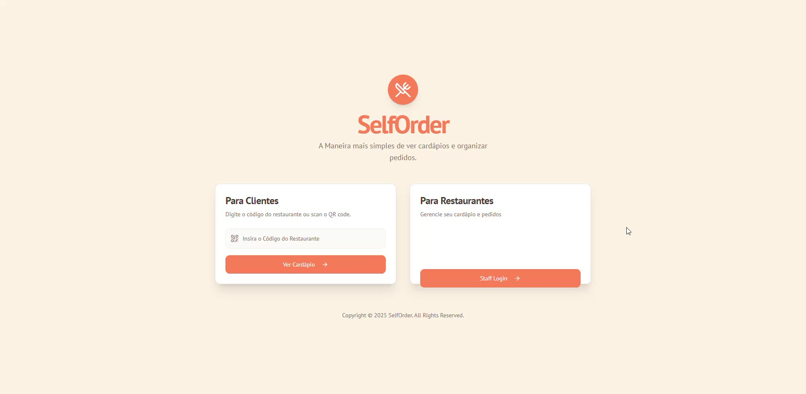
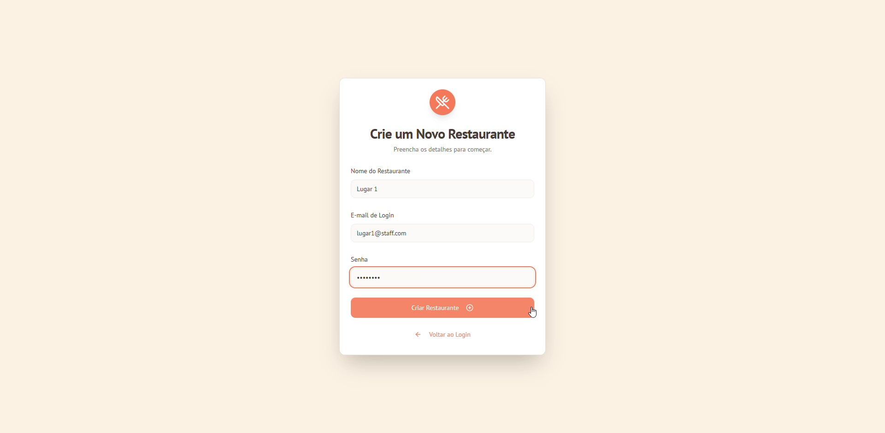
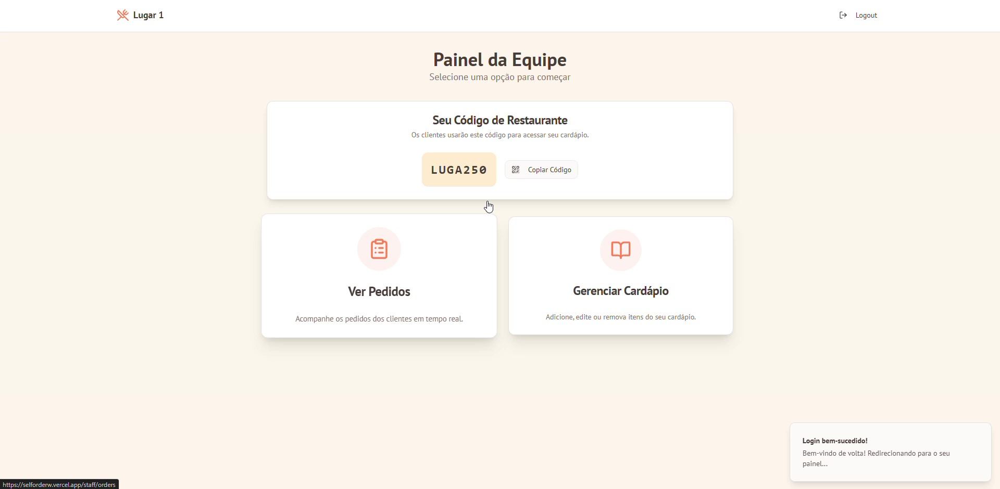
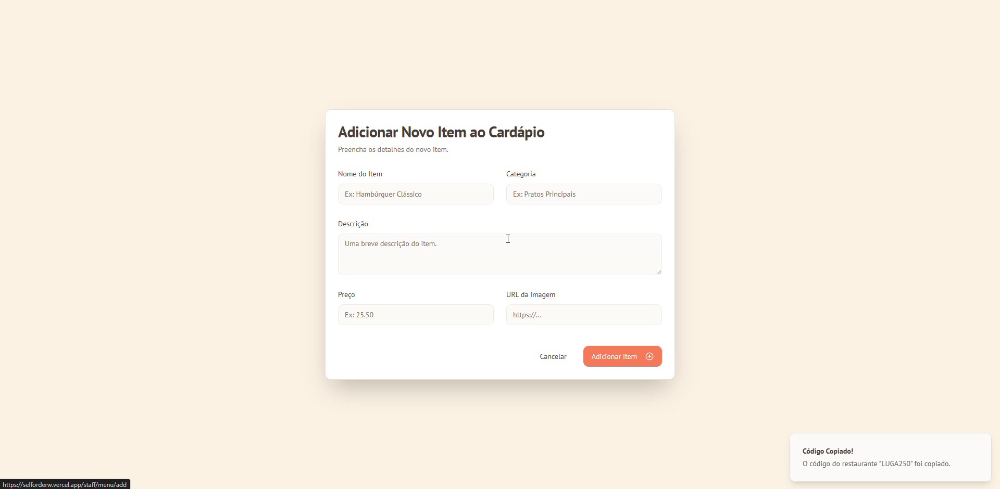
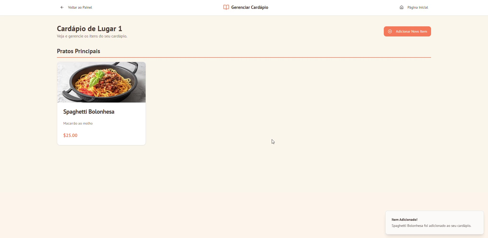
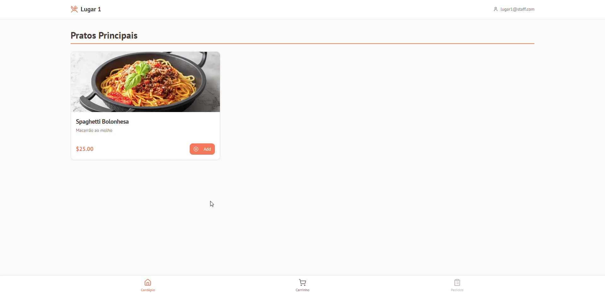
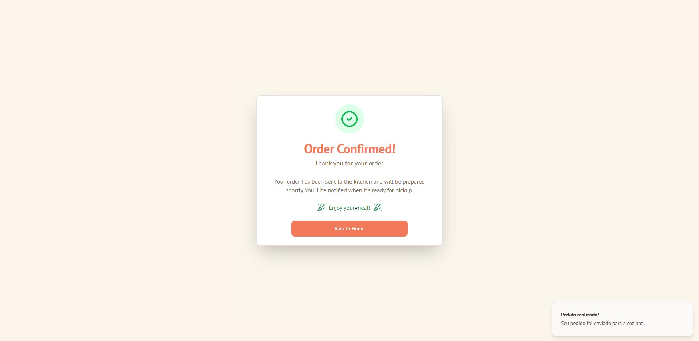
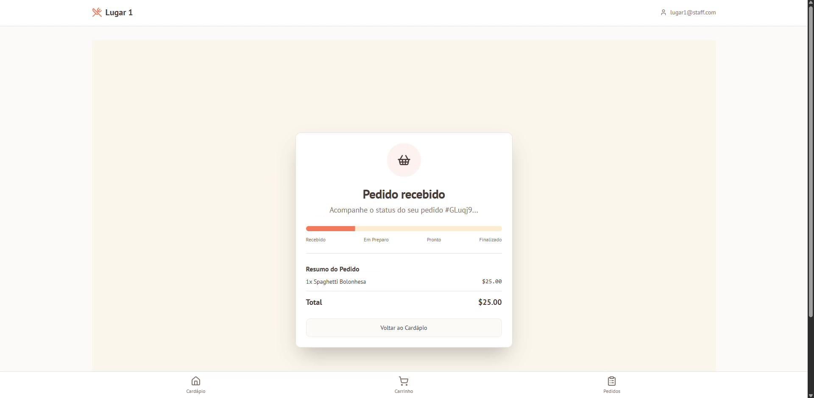
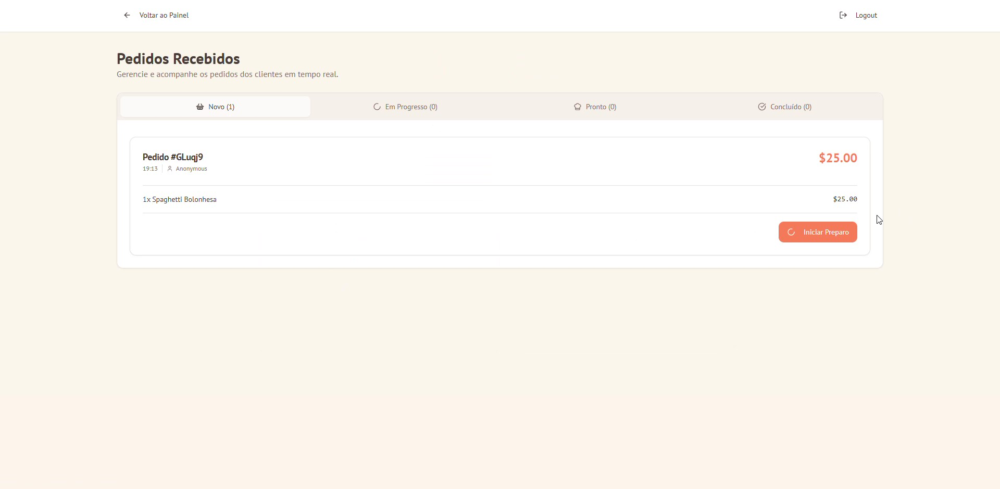

https://selforderw.vercel.app/

## Descrição do Projeto

SelfOrder é uma aplicação web desenvolvida com React e Next.js que permite aos clientes fazerem pedidos em restaurantes de forma autônoma, enquanto os funcionários podem gerenciar cardápios, pedidos e restaurantes através de um painel administrativo. A aplicação utiliza Firebase para autenticação e armazenamento de dados, e integra IA com Genkit para funcionalidades avançadas.

## Funcionalidades Principais

### Para Clientes
- **Acesso ao Cardápio**: Os clientes digitam o código único do restaurante para acessar o cardápio.
- **Visualização do Menu**: Navegação intuitiva pelos itens do menu, com categorias e descrições.
- **Carrinho de Compras**: Adição de itens ao carrinho, ajuste de quantidades e cálculo automático do total.
- **Realização de Pedidos**: Processo simples para confirmar e enviar pedidos.
- **Confirmação de Pedido**: Página de confirmação com detalhes do pedido e status.

### Para Funcionários (Staff)
- **Criação de Restaurantes**: Funcionários podem criar novos restaurantes com códigos únicos.
- **Gerenciamento de Cardápios**: Adição, edição e remoção de itens do menu, incluindo preços, descrições e imagens.
- **Visualização de Pedidos**: Painel para acompanhar pedidos em tempo real, com status de preparação e entrega.
- **KPIs e Análises**: Métricas de desempenho do restaurante, como vendas e popularidade de itens.
- **Autenticação Segura**: Login dedicado para funcionários.

## Tecnologias Utilizadas

- **Frontend**: Next.js 15, React 18, TypeScript
- **UI/UX**: Tailwind CSS, Radix UI components
- **Backend**: Firebase (Firestore, Authentication)
- **IA**: Genkit (Google GenAI) para funcionalidades de IA
- **Outros**: Lucide React para ícones, React Hook Form para formulários

## Como o App Funciona

### Fluxo para Clientes
1. **Página Inicial**: O cliente acessa a landing page e vê duas opções: para clientes e para restaurantes.
2. **Entrada do Código**: No portal do cliente, o usuário insere o código do restaurante (ex: "ABC123").
3. **Validação**: A aplicação consulta o Firestore para verificar se o restaurante existe. Se sim, redireciona para a página do restaurante.
4. **Visualização do Menu**: A página do restaurante exibe o cardápio usando o componente `MenuView`, que lista os itens categorizados.
5. **Adição ao Carrinho**: O cliente pode adicionar itens ao carrinho usando o hook `use-cart`.
6. **Checkout**: Após selecionar os itens, o cliente confirma o pedido, que é salvo no Firestore.
7. **Confirmação**: Redirecionamento para uma página de confirmação com detalhes do pedido.

### Fluxo para Funcionários
1. **Login**: Acesso via `/staff/login` com autenticação Firebase.
2. **Dashboard**: Após login, painel principal com opções para gerenciar restaurantes, menus e pedidos.
3. **Criação de Restaurante**: Em `/staff/create-restaurant`, criação de novos restaurantes com geração de código único.
4. **Gerenciamento de Menu**: Em `/staff/menu`, adição e edição de itens do menu.
5. **Visualização de Pedidos**: Em `/staff/orders`, lista de pedidos ativos e históricos.

### Integração com Firebase
- **Firestore**: Armazena dados de restaurantes, menus, pedidos e usuários.
- **Authentication**: Gerencia logins de funcionários.
- **Regras de Segurança**: Arquivo `firestore.rules` define permissões de acesso.

### IA com Genkit
- Utilizado para funcionalidades como geração de descrições de itens ou recomendações, integrado em `src/ai/`.

## Instalação e Execução

### Pré-requisitos
- Node.js (versão 18 ou superior)
- Conta no Firebase com projeto configurado
- Chaves de API do Google GenAI (para Genkit)

### Passos para Instalação
1. Clone o repositório:
   ```
   git clone <url-do-repositorio>
   cd SelfOrder-React-NextJS
   ```

2. Instale as dependências:
   ```
   npm install
   ```

3. Configure as variáveis de ambiente:
   - Crie um arquivo `.env.local` com as configurações do Firebase e GenAI.

4. Execute o servidor de desenvolvimento:
   ```
   npm run dev
   ```
   A aplicação estará disponível em `http://localhost:9002`.

5. Para desenvolvimento com Genkit:
   ```
   npm run genkit:dev
   ```

### Build para Produção
```
npm run build
npm start
```

## Estrutura do Projeto

- `src/app/`: Páginas Next.js (rotas)
- `src/components/`: Componentes reutilizáveis
- `src/firebase/`: Configuração e hooks para Firebase
- `src/hooks/`: Hooks customizados (carrinho, toast, etc.)
- `src/lib/`: Utilitários e dados mock
- `src/types/`: Definições de tipos TypeScript
- `src/ai/`: Integração com Genkit

## Prints (Screenshots)

Aqui estão algumas capturas de tela explicando o funcionamento da aplicação:

### 1. Página Inicial

*A landing page com opções para clientes e funcionários.*

### 2. Portal do Cliente

*Interface para inserir o código do restaurante.*

### 3. Visualização do Menu

*Exibição do cardápio com itens categorizados.*

### 4. Carrinho de Compras

*Carrinho com itens selecionados e total.*

### 5. Confirmação de Pedido

*Página de confirmação após envio do pedido.*

### 6. Login do Staff

*Tela de login para funcionários.*

### 7. Dashboard do Staff

*Painel principal para gerenciamento.*

### 8. Gerenciamento de Menu

*Interface para adicionar/editar itens do menu.*

### 9. Visualização de Pedidos

*Lista de pedidos ativos e históricos.*

## Contribuição

Para contribuir, faça um fork do projeto, crie uma branch para sua feature e envie um pull request.

## Licença

Copyright © 2026 MenuQR. All Rights Reserved.
